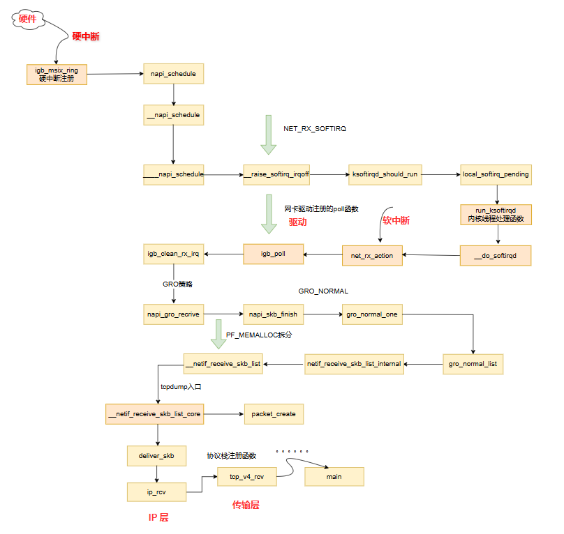

## linux内核收包过程

当数据包到达另外一台机器时，Linux数据包接收过程开始，总视角内核收包过程：

核心操作：\
1.网卡将数据帧DMA到内核RingBuffer,向CPU发起硬中断\
2.CPU响应硬中断请求，调用网卡启动时注册的中断处理函数\
3.硬中断处理速度特别快，处理完成后触发软中断\
4.内核线程ksoftirqd线程处理软中断，调用驱动的poll函数轮询收包,skb取走，新申请的skb挂\
5.poll函数将收到的数据包送到协议栈注册的ip_rcv函数,IP层\
6.数据包从IP层传递到传输层,TCP:tcp_rcv_v4;UDP:udp_rcv\
7.协议栈处理完成,数据存放于接收队列,唤醒用户进程

内核组件与源码视角收包过程：

注：所有收包代码../net_rcv_packets